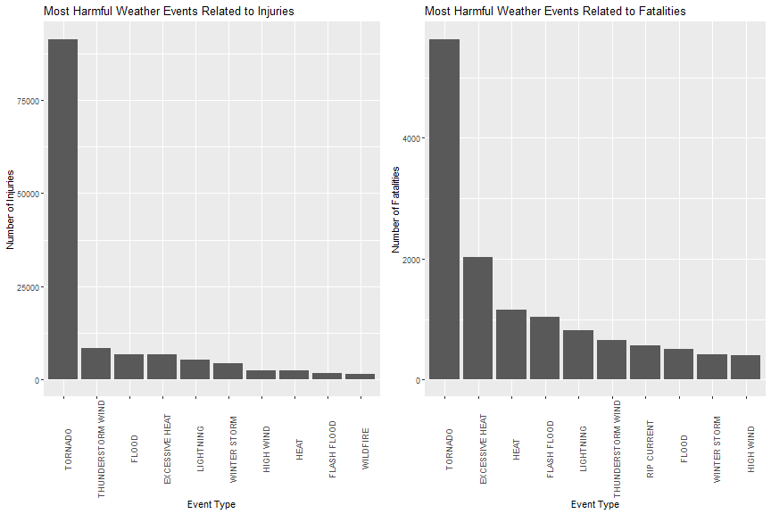
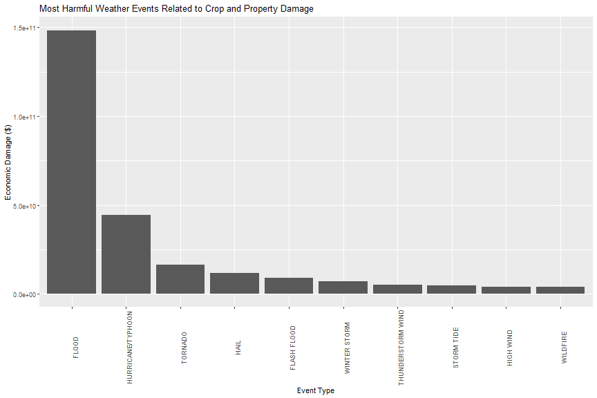

  
---
  


# Synopsis
This analysis reviews data collected from NOAA over the past 50 years to determine what weather events are most harmful to the population, and what weather events have the greatest economic consequences.  

With respect to the health of the population, **tornadoes** are clearly the most dangerous weather event for both injuries and fatalities: almost three times more deadly than excessive heat, and almost nine times more injuries than thunderstorm wind. The specific arrangement of events differ for these two factors after tornadoes, but thunderstorm wind, heat, excessive heat, flood, flash flood, lightning, winter storm and high wind are among the top 10 for both injuries and fatalities.  

The greatest economic consequence is clearly due to **floods**, which costs around three times more than the second place hurricane/typhoons. These two categories are followed by Tornadoes, Hail, and flash floods.  
  
---  

# Data Processing
Packages to be included in this analysis are listed below.

```r
require("dplyr")
require("ggplot2")
require("gridExtra")
```

The raw data was downloaded from the following.

```r
if(!file.exists("./data/NOAA.csv.bz2")) { 
      dir.create("data")
      download.file(url = "https://d396qusza40orc.cloudfront.net/repdata%2Fdata%2FStormData.csv.bz2",
                  destfile = "./data/NOAA.csv.bz2")
}
```

The raw data is read into R, and the structure can be seen below for reference.

```r
NOAA <- as_tibble(read.csv("./data/NOAA.csv.bz2", stringsAsFactor = FALSE))
str(NOAA)
```

```
## Classes 'tbl_df', 'tbl' and 'data.frame':	902297 obs. of  37 variables:
##  $ STATE__   : num  1 1 1 1 1 1 1 1 1 1 ...
##  $ BGN_DATE  : chr  "4/18/1950 0:00:00" "4/18/1950 0:00:00" "2/20/1951 0:00:00" "6/8/1951 0:00:00" ...
##  $ BGN_TIME  : chr  "0130" "0145" "1600" "0900" ...
##  $ TIME_ZONE : chr  "CST" "CST" "CST" "CST" ...
##  $ COUNTY    : num  97 3 57 89 43 77 9 123 125 57 ...
##  $ COUNTYNAME: chr  "MOBILE" "BALDWIN" "FAYETTE" "MADISON" ...
##  $ STATE     : chr  "AL" "AL" "AL" "AL" ...
##  $ EVTYPE    : chr  "TORNADO" "TORNADO" "TORNADO" "TORNADO" ...
##  $ BGN_RANGE : num  0 0 0 0 0 0 0 0 0 0 ...
##  $ BGN_AZI   : chr  "" "" "" "" ...
##  $ BGN_LOCATI: chr  "" "" "" "" ...
##  $ END_DATE  : chr  "" "" "" "" ...
##  $ END_TIME  : chr  "" "" "" "" ...
##  $ COUNTY_END: num  0 0 0 0 0 0 0 0 0 0 ...
##  $ COUNTYENDN: logi  NA NA NA NA NA NA ...
##  $ END_RANGE : num  0 0 0 0 0 0 0 0 0 0 ...
##  $ END_AZI   : chr  "" "" "" "" ...
##  $ END_LOCATI: chr  "" "" "" "" ...
##  $ LENGTH    : num  14 2 0.1 0 0 1.5 1.5 0 3.3 2.3 ...
##  $ WIDTH     : num  100 150 123 100 150 177 33 33 100 100 ...
##  $ F         : int  3 2 2 2 2 2 2 1 3 3 ...
##  $ MAG       : num  0 0 0 0 0 0 0 0 0 0 ...
##  $ FATALITIES: num  0 0 0 0 0 0 0 0 1 0 ...
##  $ INJURIES  : num  15 0 2 2 2 6 1 0 14 0 ...
##  $ PROPDMG   : num  25 2.5 25 2.5 2.5 2.5 2.5 2.5 25 25 ...
##  $ PROPDMGEXP: chr  "K" "K" "K" "K" ...
##  $ CROPDMG   : num  0 0 0 0 0 0 0 0 0 0 ...
##  $ CROPDMGEXP: chr  "" "" "" "" ...
##  $ WFO       : chr  "" "" "" "" ...
##  $ STATEOFFIC: chr  "" "" "" "" ...
##  $ ZONENAMES : chr  "" "" "" "" ...
##  $ LATITUDE  : num  3040 3042 3340 3458 3412 ...
##  $ LONGITUDE : num  8812 8755 8742 8626 8642 ...
##  $ LATITUDE_E: num  3051 0 0 0 0 ...
##  $ LONGITUDE_: num  8806 0 0 0 0 ...
##  $ REMARKS   : chr  "" "" "" "" ...
##  $ REFNUM    : num  1 2 3 4 5 6 7 8 9 10 ...
```
  
---  
  
#### Question 1: "Across the United States, which types of events (as indicated in the EVTYPE variable) are most harmful with respect to population health?"  

We will look at events that caused physical harm to the population, namely: injuries and fatalities.

```r
health <- NOAA %>% 
            mutate(EVTYPE = toupper(EVTYPE)) %>%
            filter(FATALITIES > 0 | INJURIES > 0) %>%
            group_by(EVTYPE) %>%
            summarize(Fatalities = sum(FATALITIES), Injuries = sum(INJURIES)) %>%
            arrange(desc(Injuries),desc(Fatalities))
length(unique(health$EVTYPE))
```

```
## [1] 205
```
After processing, there are 205 levels of the event type, as you can see. However, according to the [National Weather Service Storm Data Documentation](https://d396qusza40orc.cloudfront.net/repdata%2Fpeer2_doc%2Fpd01016005curr.pdf), there are only 48 categories of the event types. You can clearly see that there are multiple items, some misspellings, that should all be grouped together.

```r
grep("THUNDERSTORM",health$EVTYPE, value = TRUE)
```

```
##  [1] "THUNDERSTORM WIND"              "THUNDERSTORM WINDS"             "THUNDERSTORMW"                 
##  [4] "MARINE THUNDERSTORM WIND"       "THUNDERSTORM"                   "THUNDERSTORM  WINDS"           
##  [7] "THUNDERSTORM WINDSS"            "LIGHTNING AND THUNDERSTORM WIN" "THUNDERSTORM WINDS 13"         
## [10] "THUNDERSTORM WINDS/HAIL"        "THUNDERSTORMS WINDS"            "THUNDERSTORM WIND (G40)"       
## [13] "THUNDERSTORM WIND G52"
```

I subsetted the "health" dataset first, so that the list of EVTYPES was a bit smaller. The full NOAA dataset has 985 unique types. It does not make sense to go through all of those lines manually, if we only need to parse 205 types.

This is a bit of a labor intensive, and a long list of code, but below is the code to clean up the majority of these categories. There are some that have not been cleaned up, simply due to lack of information. (e.g. "DROWNING" is a cause of death, and does not specify the event, such as "FLOOD" or "FLASH FLOOD", etc.)

```r
health <- NOAA %>% 
            mutate(EVTYPE = toupper(EVTYPE)) %>%
            filter(FATALITIES > 0 | INJURIES > 0)

clean_events <- function(health) {
            health[grep("AVALANCE",health$EVTYPE),"EVTYPE"] <- "AVALANCHE"
            health[grep("FIRE",health$EVTYPE),"EVTYPE"] <- "WILDFIRE"
            health[grep("BLACK ICE|BLOWING SNOW|FALLING SNOW/ICE|ICE ROAD|ICY|ICE ON|LIGHT SNOW|^SNOW|^WINTER       WEATHER|WINTRY|^ICE$|ICE AND|ICE F|LATE SEASON SNOW|WINTER WEATHER",health$EVTYPE),"EVTYPE"] <- "WINTER WEATHER"
            health[grep("COASTAL|CSTL|EROSION",health$EVTYPE),"EVTYPE"] <- "COASTAL FLOOD"
            health[grep("^COLD|LOW TEMP|UNSEASONABL*. COLD|^COOL",health$EVTYPE),"EVTYPE"] <- "COLD/WIND CHILL"
            health[grep("DROUGT/EXCESSIVE HEAT",health$EVTYPE),"EVTYPE"] <- "DROUGHT"
            health[grep("MICROBURST|GUSTY|HIGH WIND|WIND DAMAGE|WINDS|^WIND$|GRADIENT WIND|^WIND",health$EVTYPE),"EVTYPE"] <- "HIGH WIND"
            health[grep("^STRONG WIND|DOWNBURST|TURBULENCE",health$EVTYPE),"EVTYPE"] <- "STRONG WIND"
            health[grep("EXCESSIVE RAINFALL|^HEAVY RAIN|TORRENTIAL|WETNESS|HEAVY PRECIP|SHOWER|RAIN",health$EVTYPE),"EVTYPE"] <- "HEAVY RAIN"
            health[grep("EXTENDED COLD|EXTREME WIND*.CHILL|RECORD COLD|EXTREME COLD",health$EVTYPE),"EVTYPE"] <- "EXTREME COLD/WIND CHILL"
            health[grep("EXTREME HEAT|RECORD HEAT|EXCESSIVE HEAT",health$EVTYPE),"EVTYPE"] <- "EXCESSIVE HEAT"
            health[grep("FLASH FLOOD|RAPIDLY RISING WATER|DAM BREAK",health$EVTYPE),"EVTYPE"] <- "FLASH FLOOD"
            health[grep("^FLOOD|RIVER*.FLOOD|^UR|^BREAKUP|MAJOR FLOOD|MINOR FLOOD|RURAL FLOOD|STREAM FLOOD|ICE JAM",health$EVTYPE),"EVTYPE"] <- "FLOOD"
            health[grep("FOG AND COLD",health$EVTYPE),"EVTYPE"] <- "FREEZING FOG"
            health[grep("FOG",health$EVTYPE),"EVTYPE"] <- "DENSE FOG"
            health[grep("FREEZE|FROST",health$EVTYPE),"EVTYPE"] <- "FROST/FREEZE"
            health[grep("FREEZING|HEAVY MIX|MIXED PRECIP",health$EVTYPE),"EVTYPE"] <- "SLEET"
            health[grep("GLAZE",health$EVTYPE),"EVTYPE"] <- "WINTER STORM"
            health[grep("SURF|HEAVY SEA|HEAVY SURF|HIGH SEA|HIGH SURF|HIGH WATER|HIGH WAVE|ROGUE WAVE|^ROUGH|SWELL",health$EVTYPE),"EVTYPE"] <- "HIGH SURF"
            health[grep("^HEAT|UNSEASONABLY WARM|^WARM",health$EVTYPE),"EVTYPE"] <- "HEAT"
            health[grep("^HEAVY SNOW|EXCESSIVE SNOW|RECORD SNOW",health$EVTYPE),"EVTYPE"] <- "HEAVY SNOW"
            health[grep("HURRICANE|TYPHOON",health$EVTYPE),"EVTYPE"] <- "HURRICANE/TYPHOON"
            health[grep("ICE STORM",health$EVTYPE),"EVTYPE"] <- "ICE STORM"
            health[grep("LANDSLIDE|MUDSLIDE|LANDSLUMP|LANDSPOUT|SLIDE",health$EVTYPE),"EVTYPE"] <- "DEBRIS FLOW"
            health[grep("LIGHTNING|LIGHTING|LIGNTNING",health$EVTYPE),"EVTYPE"] <- "LIGHTNING"
            health[grep("MARINE STRONG",health$EVTYPE),"EVTYPE"] <- "MARINE HIGH WIND"
            health[grep("RIP CURRENT",health$EVTYPE),"EVTYPE"] <- "RIP CURRENT"
            health[grep("HAIL",health$EVTYPE),"EVTYPE"] <- "HAIL"
            health[grep("STORM SURGE|TIDE",health$EVTYPE),"EVTYPE"] <- "STORM TIDE"
            health[grep("THUNDERSTORM|TSTM|THUNDERTORM|WIND STORM|THUNDERSTROM WIND|TUNDERSTORM WIND",health$EVTYPE),"EVTYPE"] <- "THUNDERSTORM WIND"
            health[grep("THUNDERSNOW|^WINTER STORM|BLIZZARD|ICE STORM",health$EVTYPE),"EVTYPE"] <- "WINTER STORM"
            health[grep("TIDAL FLOODING|LAKE*.FLOOD",health$EVTYPE),"EVTYPE"] <- "LAKESHORE FLOOD"
            health[grep("TORNADO|WHIRLWIND|GUSTNADO|TORNDAO",health$EVTYPE),"EVTYPE"] <- "TORNADO"
            health[grep("TROPICAL STORM",health$EVTYPE),"EVTYPE"] <- "TROPICAL STORM"
            health[grep("WATERSP",health$EVTYPE),"EVTYPE"] <- "WATERSPOUT"
            health[grep("BLOWING DUST",health$EVTYPE),"EVTYPE"] <- "DUST STORM"
            health[grep("LAKE*.SNOW",health$EVTYPE),"EVTYPE"] <- "LAKE-EFFECT SNOW"
            health
}

health <- clean_events(health) %>%
            group_by(EVTYPE) %>%
            summarize(Fatalities = sum(FATALITIES, na.rm=TRUE), Injuries = sum(INJURIES, na.rm=TRUE))
top_injury_data <- health %>% 
            select(EVTYPE,Injuries) %>% 
            arrange(desc(Injuries)) %>% 
            top_n(10)
top_fatality_data <- health %>% 
            select(EVTYPE,Fatalities) %>% 
            arrange(desc(Fatalities)) %>% 
            top_n(10)

length(unique(health$EVTYPE))
```

```
## [1] 44
```
We have parsed this down to 44 categories, which should give us a much better answer on the total injuries and fatalities caused by these events. The final results can be seen in the results section below.
  
---  
  
#### Question 2: "Across the United States, which types of events have the greatest economic consequences?"  

Here we will process the data to look at economic factors, namely: property damage and crop damage. The variables needed here are "PROPDMG" and "CROPDMG" which gives the numeric dollar value in property and crop damage, and "PROPDMGEXP" and "CROPDMGEXP" which give the suffix of the dollars (k for thousand, M for million, B for billion).  

However, the EXP variables have some messy data:

```r
unique(NOAA$PROPDMGEXP)
```

```
##  [1] "K" "M" ""  "B" "m" "+" "0" "5" "6" "?" "4" "2" "3" "h" "7" "H" "-" "1" "8"
```

```r
unique(NOAA$CROPDMGEXP)
```

```
## [1] ""  "M" "K" "m" "B" "?" "0" "k" "2"
```
If we look to see how much of a problem this is, we see these incorrect values only account for 0.04% of the data. These will simply be removed from the analysis.

```r
nrow(NOAA[which(!(NOAA$PROPDMGEXP %in% toupper(c("K","B","M","")))),])
```

```
## [1] 328
```

```r
nrow(NOAA[which(!(NOAA$CROPDMGEXP %in% toupper(c("K","B","M","")))),])
```

```
## [1] 49
```

```r
(nrow(NOAA[which(!(NOAA$PROPDMGEXP %in% toupper(c("K","B","M","")))),]) +
      nrow(NOAA[which(!(NOAA$CROPDMGEXP %in% toupper(c("K","B","M","")))),])) / 
      nrow(NOAA) * 100
```

```
## [1] 0.042
```

Filtering the data to look at any economic impact, we will again take a look at which event types we need to clean up.

```r
economic <- NOAA %>%
            mutate(EVTYPE = toupper(EVTYPE)) %>%
            mutate(PROPDMGEXP = toupper(PROPDMGEXP)) %>%
            mutate(CROPDMGEXP = toupper(CROPDMGEXP)) %>%
            filter(CROPDMG > 0 | PROPDMG > 0)
length(unique(economic$EVTYPE))
```

```
## [1] 397
```
Just like with the health data, we have a bunch of event types that need to be cleaned up, with 397 unique event types. We will simply run this through the same clean_events function we created earlier for the health dataset.  

```r
economic <- clean_events(economic)
length(unique(economic$EVTYPE))
```

```
## [1] 46
```
Which gives us a much cleaner 46 event types to analyze.  

Now, we will need to modify the actual property and crop damage costs. They are both split into two variables: a numeric column, and a text column stating the suffix (thousand, million, billion). This needs to be modified to a single variable for both property and crop damage, i.e. PROPDMG value of 25.5 and PROPDMGEXP value of "M" needs to be combined to a value of "25,500,000".  

```r
economic$PROPDMGEXP <- with(economic,case_when(PROPDMGEXP=="K" ~ 1000, PROPDMGEXP=="M" ~ 1000000, PROPDMGEXP=="B" ~ 1000000000, PROPDMGEXP == NA ~ 1))
economic$CROPDMGEXP <- with(economic,case_when(CROPDMGEXP=="K" ~ 1000, CROPDMGEXP=="M" ~ 1000000, CROPDMGEXP=="B" ~ 1000000000, CROPDMGEXP == NA ~ 1))
top_economic <- economic %>%
            mutate(DMG = PROPDMG * PROPDMGEXP + CROPDMG * CROPDMGEXP) %>%
            group_by(EVTYPE) %>%
            summarize(Damage = sum(DMG, na.rm=TRUE)) %>%
            arrange(desc(Damage)) %>% 
            top_n(10)
```
The data has now been processed, and the results of the data can be seen below.
  
---  
  
# Results

### Question 1: "Across the United States, which types of events (as indicated in the EVTYPE variable) are most harmful with respect to population health?"  
We can take a look at our health dataset and see the 10 events that caused the most injuries, and the 10 events that caused the most fatalities.  

```r
top_injury_data
```

```
## # A tibble: 10 x 2
##    EVTYPE            Injuries
##    <chr>                <dbl>
##  1 TORNADO              91407
##  2 THUNDERSTORM WIND     8523
##  3 FLOOD                 6873
##  4 EXCESSIVE HEAT        6730
##  5 LIGHTNING             5232
##  6 WINTER STORM          4350
##  7 HIGH WIND             2568
##  8 HEAT                  2513
##  9 FLASH FLOOD           1802
## 10 WILDFIRE              1608
```

```r
top_fatality_data
```

```
## # A tibble: 10 x 2
##    EVTYPE            Fatalities
##    <chr>                  <dbl>
##  1 TORNADO                 5637
##  2 EXCESSIVE HEAT          2020
##  3 HEAT                    1158
##  4 FLASH FLOOD             1036
##  5 LIGHTNING                817
##  6 THUNDERSTORM WIND        660
##  7 RIP CURRENT              572
##  8 FLOOD                    511
##  9 WINTER STORM             414
## 10 HIGH WIND                405
```

```r
injury_plot <- ggplot(top_injury_data,aes(x=reorder(EVTYPE, -Injuries), y=Injuries))+
                  geom_bar(stat="identity") +
                  theme(axis.text.x = element_text(angle = 90)) +
                  labs(x="Event Type", y="Number of Injuries", title="Most Harmful Weather Events Related to Injuries")
fatality_plot <- ggplot(top_fatality_data,aes(x=reorder(EVTYPE, -Fatalities), y=Fatalities))+
                  geom_bar(stat="identity") +
                  theme(axis.text.x = element_text(angle = 90)) +
                  labs(x="Event Type", y="Number of Fatalities", title="Most Harmful Weather Events Related to Fatalities")
grid.arrange(injury_plot, fatality_plot, ncol=2)
```


  
---  
  
### Question 2: "Across the United States, which types of events have the greatest economic consequences?"  
The top 10 events that caused the greatest economic consequences can be seen below. the greatest economic consequences is being defined as the total sum of crop damage and property damage. Unlike injuries and fatalities, these are both in similar terms of dollars and could be simply combined.  

```r
top_economic
```

```
## # A tibble: 10 x 2
##    EVTYPE                  Damage
##    <chr>                    <dbl>
##  1 FLOOD             148345140700
##  2 HURRICANE/TYPHOON  44220000800
##  3 TORNADO            16520218150
##  4 HAIL               11652348140
##  5 FLASH FLOOD         9223297180
##  6 WINTER STORM        7175061800
##  7 THUNDERSTORM WIND   4987249500
##  8 STORM TIDE          4644738000
##  9 HIGH WIND           3970846450
## 10 WILDFIRE            3838549570
```

```r
ggplot(top_economic, aes(x=reorder(EVTYPE, -Damage), y=Damage))+
      geom_bar(stat="identity") +
      theme(axis.text.x = element_text(angle = 90)) +
      labs(x="Event Type", y="Economic Damage ($)", title="Most Harmful Weather Events Related to Crop and Property Damage")
```


